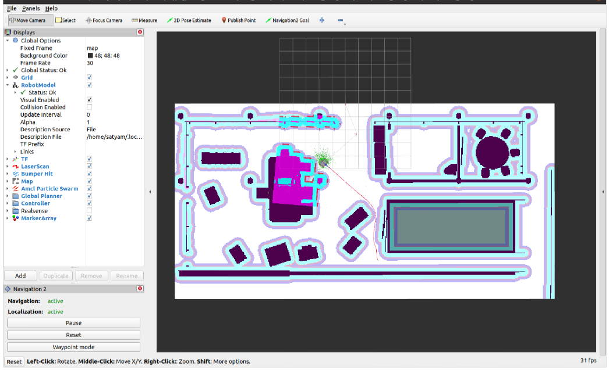

<h1>Development of an Autonomous Simulation, Testing and Data Generation Framework for Mobile Robots within Randomly Generated Scenarios</h1>

<h2>Description</h2>
<b>Create an autonomous framework utilizing the NVIDIA Omniverse Isaac Sim with the digital twin concept as its foundation to generate mobile robot path datasets and navigation testing.
</b>
<br />
<br />

<h2>System and Software Used</h2>

- <b>NVIDIA RTX 4090Ti Workstation</b>
- <b>Ubuntu 20.04 LTS (64-bit Linux system)</b>
- <b>NVIDIA Isaac Sim 2022.2.0</b>
  - Python 3.7 Environment
  - ROS2 Bridge enabled
- <b>Robot Operating System (ROS2)</b>
  - Python 3.8 dependent
  - ROS2 Foxy
  - Nav2 Installed

<h2>Languages Used</h2>

- <b>Python</b>
- <b>C++</b>

<h2>Framework Design</h2>

<p align="center">
<br>
<em>Framework Design</em>
</p>

<h2>Framework Dvelopment</h2>

<h3>Simulation Setup</h3>
<p align="center">
<br>
</p>

<h3>Plausible Scenario Generation</h3>
<p align="center">
<br>
</p>

<h3>Map Generation</h3>
<p align="center">
<br>
</p>

<h3>ROS2 setup and launch</h3>
<p align="center">
<br>
</p>

<h3>ROS clock synchronization</h3>
<p align="center">
<br>
</p>

<h3>Robot Data Logger</h3>
<p align="center">
<br>
</p>

<h2>Scene and Taskset Generation</h2>

<p align="center">
<br>
</p>

<h2>Rviz in action</h2>

<p align="center">
<br>
</p>

<h2>Generated Robot CSV Data</h2>

<p align="center">
<br>
</p>

<h2>Sampele Warehouse Simulation Scenarios</h2>
<p align="center">
<br>
</p>

<h2>Sampele Lab Simulation Scenarios</h2>

<p align="center">
<br>
</p>


<h2>References</h2>

- <b>Francisco Rubio, Francisco Valero, and Carlos Llopis-Albert.</b> A review of mobile robots: Concepts, methods, theoretical framework, and applications. International Journal of Advanced Robotic Systems, 16, 3 2019. ISSN 17298814. doi: 10.1177/1729881419839596.
- <b>Khaled El Emam.</b> Accelerating ai with synthetic data generating data for ai projects. 2020.
- <b>Maximiliano Rojas, Gabriel Hermosilla, Daniel Yunge, and Gonzalo Farias.</b> An easy to use deep reinforcement learning library for ai mobile robots in isaac sim. Applied Sciences 2022, Vol. 12, Page 8429, 12:8429, 8 2022. ISSN 2076-3417. doi: 10.3390/APP12178429.
- <b>Giuseppe Fragapane, René de Koster, Fabio Sgarbossa, and Jan Ola Strandhagen.</b> Planning and control of autonomous mobile robots for intralogistics: Literature review and research agenda. European Journal of Operational Research, 294:405–426, 10 2021. ISSN 0377-2217. doi: 10.1016/J.EJOR.2021.01.019.
- <b>ukovicaleksa.</b> Github - lukovicaleksa/grid-mapping-in-ros: Creating occupancy grid maps using static state bayes filter and bresenham’s algorithm for mobile robot (turtlebot3burger) in ros. URL https://github.com/lukovicaleksa/grid-mapping-in-ROS.
- <b>Open Navigation LLC.</b> Nav2 — navigation 2 1.0.0 documentation. URL https://navigation.ros.org/.
- <b>NVIDIA.</b> Isaac sim - robotics simulation and synthetic data generation | nvidia developer. URL https://developer.nvidia.com/isaac-sim.
- <b>NVIDIA.</b> Included environments and robots — isaacsim latest documentation. URL https: //docs.omniverse.nvidia.com/isaacsim/latest/reference_assets.html.
- <b>Daniel Michelon De Carli, Fernando Bevilacqua, Cesar Tadeu Pozzer, and Marcos Cordeiro d’Ornellas.</b> A survey of procedural content generation techniques suitable to game development. IEEE, 11 2011. ISBN 978-1-4673-0797-0. doi: 10.1109/SBGAMES.
- <b>Jiajun Wu, Chengkai Zhang, Tianfan Xue, William T Freeman, and Joshua B Tenenbaum.</b> Learning a probabilistic latent space of object shapes via 3d generative-adversarial modeling. In Advances in Neural Information Processing Systems, 2016.
- <b>Jingbo Zhang, Xiaoyu Li, Ziyu Wan, Can Wang, and Jing Liao.</b> Text2nerf: Text-driven 3d-scene generation with neural radiance fields. 5 2023.
- <b>Yu Cheng, Zhiyong Sun, Yan Shi, and Lixin Dong.</b> Controllable scene generation from natural language. Procedia Computer Science, 209:122–131, 1 2022. ISSN 18770509. doi: 10. 1016/j.procs.2022.10.106.


<!--
 ```diff
- text in red
+ text in green
! text in orange
# text in gray
@@ text in purple (and bold)@@
```
--!>
